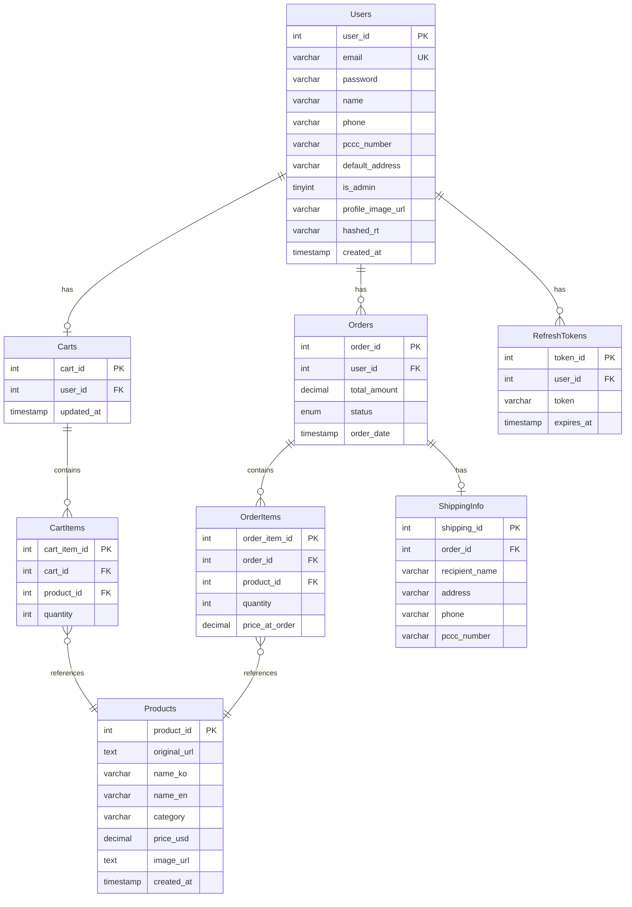

# 🛒 JikguMate Backend (직구메이트)

<div align="center">


**해외 직구를 더 쉽고 편리하게! 직구메이트 백엔드 서버**

[빠른 시작](#4-빠른-시작-quick-start) •
[API 문서](#9-api-엔드포인트-주요-로직-api-logic--examples) •
[배포](#10-docker-배포)

</div>

---

## 📋 목차

1. [프로젝트 소개](#1-프로젝트-소개)
2. [주요 기능](#2-주요-기능-key-features)
3. [기술 스택](#3-기술-스택-tech-stack)
4. [빠른 시작](#4-빠른-시작-quick-start)
5. [폴더 구조](#5-폴더-구조-folder-structure)
6. [ERD (데이터베이스 설계)](#6-erd-데이터베이스-설계)
7. [아키텍처 개요](#7-아키텍처-개요-architecture)
8. [모듈 상세 설명](#8-모듈-상세-설명)
9. [API 엔드포인트](#9-api-엔드포인트-주요-로직-api-logic--examples)
10. [Docker 배포](#10-docker-배포)
11. [테스트](#11-테스트-tests)

---

## 1. 프로젝트 소개

**JikguMate**는 사용자가 복잡한 해외 직구 과정을 간편하게 경험할 수 있도록 돕는 플랫폼입니다.

백엔드 서버는 **상품 정보 수집(크롤링)**, **사용자 인증**, **장바구니**, **주문 처리** 등 핵심 비즈니스 로직을 담당합니다.

### 🎯 주요 목표

| 목표       | 설명                                               |
| ---------- | -------------------------------------------------- |
| **확장성** | NestJS의 모듈 패턴을 활용하여 기능 확장 용이       |
| **안정성** | TypeORM을 통한 데이터 무결성 보장 및 트랜잭션 처리 |
| **편의성** | Swagger API 문서를 통한 프론트엔드 협업 효율화     |
| **보안성** | JWT 기반 인증 + Refresh Token으로 보안 강화        |

---

## 2. 주요 기능 (Key Features)

### 🔐 인증 (Authentication)

- **회원가입/로그인**: 이메일 기반 인증, `bcrypt` 암호화
- **JWT 인증**: Access Token & Refresh Token 기반의 보안 인증 시스템
- **Guard**: 인증된 사용자만 접근 가능한 보호된 라우트 (`JwtAuthGuard`, `AdminGuard`)

### 📦 상품 (Products)

- **크롤링 (Crawling)**: AliExpress, Amazon 등 해외 쇼핑몰 URL을 입력받아 상품 정보(가격, 이미지, 이름) 자동 분석 및 저장
- **상품 목록**: 전체 상품 조회 및 상세 조회
- **카테고리 분류**: 상품별 카테고리 관리

### 🛒 장바구니 (Carts)

- **담기/수정/삭제**: 상품을 장바구니에 추가하고 수량 변경 가능
- **실시간 연동**: 유저별 장바구니 데이터 영구 저장 (DB)
- **중복 처리**: 동일 상품 추가 시 수량 자동 업데이트

### 🧾 주문 (Orders)

- **주문 생성**: 장바구니 상품 또는 단일 상품 주문 (트랜잭션 처리)
- **주문 내역**: 내 주문 내역 조회 (`/orders/my`)
- **주문 관리**: 주문 상태 변경 (`PENDING` → `SHIPPING` → `DELIVERED`)
- **주문 취소**: Cascade 삭제로 연관 데이터 자동 정리

### 👤 사용자 (Users)

- **프로필 관리**: 프로필 이미지 업로드 (Supabase Storage)
- **개인통관고유부호**: 직구에 필요한 PCCC 번호 관리
- **기본 배송지**: 자주 사용하는 배송지 저장

---

## 3. 기술 스택 (Tech Stack)

### Backend Framework

| 기술           | 버전  | 설명                                          |
| -------------- | ----- | --------------------------------------------- |
| **NestJS**     | v11.x | 모듈식 아키텍처를 제공하는 Node.js 프레임워크 |
| **TypeScript** | v5.x  | 정적 타입을 지원하는 JavaScript 상위 집합     |

### Database & ORM

| 기술        | 버전   | 설명                            |
| ----------- | ------ | ------------------------------- |
| **MySQL**   | 8.x    | 관계형 데이터베이스 관리 시스템 |
| **TypeORM** | v0.3.x | TypeScript용 ORM                |

### Authentication & Security

| 기술         | 버전   | 설명                     |
| ------------ | ------ | ------------------------ |
| **Passport** | v0.7.x | Node.js 인증 미들웨어    |
| **JWT**      | -      | JSON Web Token 기반 인증 |
| **bcrypt**   | v6.x   | 비밀번호 해싱 라이브러리 |

### Crawling & Scraping

| 기술          | 버전  | 설명                   |
| ------------- | ----- | ---------------------- |
| **Puppeteer** | v24.x | Headless Chrome 자동화 |
| **Cheerio**   | v1.x  | HTML 파싱 및 스크래핑  |

### Storage & Infrastructure

| 기술                 | 설명               |
| -------------------- | ------------------ |
| **Supabase Storage** | 이미지 파일 저장소 |
| **Docker**           | 컨테이너화 및 배포 |
| **Swagger**          | API 문서 자동화    |

---

## 4. 빠른 시작 (Quick Start)

### 4-1. 사전 요구사항

- Node.js v20 이상
- MySQL 8.x
- npm 또는 yarn

### 4-2. 의존성 설치

```bash
npm install
```

### 4-3. 환경변수 설정

프로젝트 루트에 `.env` 파일을 생성하고 다음 변수를 설정하세요.

```env
# Server
PORT=3000

# Database
DB_HOST=localhost
DB_PORT=3306
DB_USERNAME=root
DB_PASSWORD=your_password
DB_DATABASE=jikgumate

# JWT
JWT_SECRET=your_jwt_secret_key
JWT_REFRESH_SECRET=your_refresh_secret_key

# Supabase (이미지 저장용)
SUPABASE_URL=your_supabase_url
SUPABASE_ANON_KEY=your_supabase_anon_key

# Optional (Crawling - Docker 환경이 아닌 경우)
PUPPETEER_EXECUTABLE_PATH=/path/to/chrome
```

### 4-4. 데이터베이스 생성

```sql
CREATE DATABASE jikgumate;
```

> ⚠️ TypeORM `synchronize: true` 설정으로 엔티티 기반 테이블이 자동 생성됩니다.  
> 프로덕션 환경에서는 `synchronize: false`로 설정하고 마이그레이션을 사용하세요.

### 4-5. 개발 서버 실행

```bash
# 개발 모드 실행 (Watch 모드)
npm run start:dev

# 일반 실행
npm run start

# 프로덕션 실행
npm run build
npm run start:prod
```

### 4-6. API 문서 확인

서버가 정상적으로 실행되면 Swagger UI에서 API 문서를 확인할 수 있습니다.

🔗 **API Docs**: [http://localhost:3000/api](http://localhost:3000/api)

---

## 5. 폴더 구조 (Folder Structure)

```
src/
├── main.ts                    # 앱 진입점 (Swagger, Pipe 설정)
├── app.module.ts              # 메인 앱 모듈 (모듈 통합)
├── app.controller.ts          # 앱 컨트롤러
├── app.service.ts             # 앱 서비스
├── supabase.ts                # Supabase 클라이언트 설정
│
├── auth/                      # 🔐 인증 모듈
│   ├── auth.module.ts
│   ├── auth.controller.ts
│   ├── auth.service.ts
│   ├── dto/
│   │   └── login.dto.ts
│   └── strategies/
│       ├── jwt.strategy.ts    # Access Token 전략
│       └── rt.strategy.ts     # Refresh Token 전략
│
├── users/                     # 👤 사용자 모듈
│   ├── users.module.ts
│   ├── users.controller.ts
│   ├── users.service.ts
│   ├── dto/
│   └── entities/
│       └── user.entity.ts
│
├── products/                  # 📦 상품 모듈 (크롤링 포함)
│   ├── products.module.ts
│   ├── products.controller.ts
│   ├── products.service.ts
│   ├── dto/
│   └── entities/
│       └── product.entity.ts
│
├── carts/                     # 🛒 장바구니 모듈
│   ├── carts.module.ts
│   ├── carts.controller.ts
│   ├── carts.service.ts
│   ├── dto/
│   └── entities/
│       ├── cart.entity.ts
│       └── cart-item.entity.ts
│
├── orders/                    # 🧾 주문 모듈
│   ├── orders.module.ts
│   ├── orders.controller.ts
│   ├── orders.service.ts
│   ├── dto/
│   └── entities/
│       └── order.entity.ts
│
├── order-items/               # 📋 주문 상품 모듈
│   ├── order-items.module.ts
│   ├── order-items.controller.ts
│   ├── order-items.service.ts
│   └── entities/
│       └── order-item.entity.ts
│
├── shipping-info/             # 🚚 배송 정보 모듈
│   ├── shipping-info.module.ts
│   ├── shipping-info.controller.ts
│   ├── shipping-info.service.ts
│   └── entities/
│       └── shipping-info.entity.ts
│
├── refresh-tokens/            # 🔄 리프레시 토큰 모듈
│   └── ...
│
├── common/                    # 🔧 공통 유틸리티
│   ├── filter/
│   │   ├── all-exception.filter.ts
│   │   └── normalize.ts
│   ├── guard/
│   │   └── admin-guard.guard.ts
│   └── interceptor/
│       └── response-format.interceptor.ts
│
└── configs/                   # ⚙️ 설정 파일
    ├── cors.config.ts
    └── validation.config.ts
```

---

## 6. ERD (데이터베이스 설계)



### 주요 관계 설명

| 관계                      | 설명                           |
| ------------------------- | ------------------------------ |
| `Users` → `Orders`        | 1:N - 한 유저가 여러 주문 가능 |
| `Users` → `Carts`         | 1:1 - 유저당 하나의 장바구니   |
| `Orders` → `OrderItems`   | 1:N - 하나의 주문에 여러 상품  |
| `Orders` → `ShippingInfo` | 1:1 - 주문당 하나의 배송 정보  |
| `Carts` → `CartItems`     | 1:N - 장바구니에 여러 상품     |

---

## 7. 아키텍처 개요 (Architecture)

본 프로젝트는 **NestJS**의 표준 **Layered Architecture**를 따릅니다.

```
┌─────────────────────────────────────────────────────────────────┐
│                        Client (Frontend)                         │
└─────────────────────────────────────────────────────────────────┘
                                │
                                ▼
┌─────────────────────────────────────────────────────────────────┐
│                         Controller Layer                         │
│  • 요청/응답 처리 • 유효성 검사 (DTO) • 라우팅                    │
└─────────────────────────────────────────────────────────────────┘
                                │
                                ▼
┌─────────────────────────────────────────────────────────────────┐
│                          Service Layer                           │
│  • 비즈니스 로직 • 트랜잭션 처리 • 데이터 가공                    │
└─────────────────────────────────────────────────────────────────┘
                                │
                                ▼
┌─────────────────────────────────────────────────────────────────┐
│                        Repository Layer                          │
│  • TypeORM Repository • 데이터베이스 쿼리                        │
└─────────────────────────────────────────────────────────────────┘
                                │
                                ▼
┌─────────────────────────────────────────────────────────────────┐
│                      Database (MySQL)                            │
└─────────────────────────────────────────────────────────────────┘
```

### 핵심 설계 패턴

1. **Controller**: 클라이언트 요청을 받아 유효성 검사 수행, Service로 전달
2. **Service**: 비즈니스 로직 수행, 트랜잭션 처리
3. **Repository**: 데이터베이스와의 직접적인 통신 담당
4. **DTO**: 데이터 전송 객체로 타입 안전성 보장
5. **Entity**: 데이터베이스 테이블 매핑

---

## 8. 모듈 상세 설명

### 🔐 Auth Module

JWT 기반의 인증 시스템을 담당합니다.

| 구성요소      | 설명                      |
| ------------- | ------------------------- |
| `JwtStrategy` | Access Token 검증 전략    |
| `RtStrategy`  | Refresh Token 검증 전략   |
| `AuthGuard`   | 인증된 사용자만 접근 허용 |

### 🔧 Common Module

재사용 가능한 공통 컴포넌트들입니다.

| 구성요소                    | 설명                  |
| --------------------------- | --------------------- |
| `AllExceptionFilter`        | 전역 예외 처리 필터   |
| `ResponseFormatInterceptor` | 응답 형식 표준화      |
| `AdminGuard`                | 관리자 권한 확인 가드 |

### 📦 Products Module

상품 관리 및 크롤링 기능을 담당합니다.

- **Puppeteer**: Headless 브라우저로 동적 페이지 크롤링
- **Cheerio**: HTML 파싱 및 데이터 추출
- **puppeteer-extra-plugin-stealth**: 봇 탐지 우회

---

## 9. API 엔드포인트 주요 로직 (API Logic & Examples)

### 🔐 Auth (인증)

| Method | Endpoint        | 설명                              |
| ------ | --------------- | --------------------------------- |
| POST   | `/auth/signup`  | 회원가입 (비밀번호 bcrypt 암호화) |
| POST   | `/auth/login`   | 로그인 (AT + RT 발급)             |
| POST   | `/auth/refresh` | Access Token 갱신                 |
| POST   | `/auth/logout`  | 로그아웃 (RT 무효화)              |

### 👤 Users (사용자)

| Method | Endpoint               | 설명                 |
| ------ | ---------------------- | -------------------- |
| GET    | `/users/check-email`   | 이메일 중복 확인     |
| GET    | `/users/me`            | 내 정보 조회         |
| PATCH  | `/users/me`            | 내 정보 수정         |
| POST   | `/users/profile-image` | 프로필 이미지 업로드 |

### 📦 Products (상품)

| Method | Endpoint            | 설명                     |
| ------ | ------------------- | ------------------------ |
| GET    | `/products/all`     | 전체 상품 목록 (경량화)  |
| GET    | `/products/:id`     | 상품 상세 정보           |
| POST   | `/products/analyze` | URL 크롤링으로 상품 추가 |
| DELETE | `/products/:id`     | 상품 삭제 (관리자)       |

### 🛒 Carts (장바구니)

| Method | Endpoint           | 설명                          |
| ------ | ------------------ | ----------------------------- |
| GET    | `/carts`           | 내 장바구니 조회              |
| POST   | `/carts/items`     | 상품 담기 (중복 시 수량 증가) |
| PATCH  | `/carts/items/:id` | 수량 변경                     |
| DELETE | `/carts/items/:id` | 상품 제거                     |

### 🧾 Orders (주문)

| Method | Endpoint             | 설명                     |
| ------ | -------------------- | ------------------------ |
| GET    | `/orders/my`         | 내 주문 내역 (JWT 기반)  |
| GET    | `/orders/:id`        | 주문 상세 조회           |
| POST   | `/orders`            | 주문 생성 (트랜잭션)     |
| PATCH  | `/orders/:id/status` | 주문 상태 변경           |
| DELETE | `/orders/:id`        | 주문 취소 (Cascade 삭제) |

### 📬 주문 상태 흐름

```
PENDING (주문완료) → SHIPPING (배송중) → DELIVERED (배송완료)
```

---

## 10. Docker 배포

### Dockerfile 특징

- **Node.js 20 Slim** 베이스 이미지
- **Google Chrome** 설치 (Puppeteer 크롤링용)
- 다국어 폰트 지원 (중국어, 일본어, 아랍어 등)

### 로컬 Docker 빌드 및 실행

```bash
# 이미지 빌드
docker build -t jikgumate-backend .

# 컨테이너 실행
docker run -d \
  --name jikgumate-api \
  -p 3000:3000 \
  -e DB_HOST=host.docker.internal \
  -e DB_PORT=3306 \
  -e DB_USERNAME=root \
  -e DB_PASSWORD=your_password \
  -e DB_DATABASE=jikgumate \
  -e JWT_SECRET=your_jwt_secret \
  -e JWT_REFRESH_SECRET=your_refresh_secret \
  jikgumate-backend
```

### Docker Compose (선택)

```yaml
version: '3.8'
services:
  api:
    build: .
    ports:
      - '3000:3000'
    environment:
      - DB_HOST=db
      - DB_PORT=3306
      - DB_USERNAME=root
      - DB_PASSWORD=rootpassword
      - DB_DATABASE=jikgumate
      - JWT_SECRET=your_secret
      - JWT_REFRESH_SECRET=your_refresh_secret
    depends_on:
      - db

  db:
    image: mysql:8
    environment:
      - MYSQL_ROOT_PASSWORD=rootpassword
      - MYSQL_DATABASE=jikgumate
    ports:
      - '3306:3306'
    volumes:
      - mysql_data:/var/lib/mysql

volumes:
  mysql_data:
```

---

## 11. 테스트 (Tests)

Jest를 사용한 유닛 테스트 및 E2E 테스트를 지원합니다.

```bash
# 유닛 테스트 실행
npm run test

# Watch 모드
npm run test:watch

# 테스트 커버리지 확인
npm run test:cov

# E2E 테스트
npm run test:e2e
```

---

## 📝 스크립트 명령어

| 명령어               | 설명                |
| -------------------- | ------------------- |
| `npm run start`      | 서버 실행           |
| `npm run start:dev`  | 개발 모드 (Watch)   |
| `npm run start:prod` | 프로덕션 실행       |
| `npm run build`      | TypeScript 빌드     |
| `npm run lint`       | ESLint 검사 및 수정 |
| `npm run format`     | Prettier 포맷팅     |
| `npm run test`       | 테스트 실행         |
| `npm run test:cov`   | 테스트 커버리지     |

---

## 🤝 기여 방법

1. Fork the repository
2. Create your feature branch (`git checkout -b feature/AmazingFeature`)
3. Commit your changes (`git commit -m 'Add some AmazingFeature'`)
4. Push to the branch (`git push origin feature/AmazingFeature`)
5. Open a Pull Request

---

## 📄 라이센스

This project is licensed under the **UNLICENSED** License.

---

<div align="center">

**Made with ❤️ by JikguMate Team**

</div>
